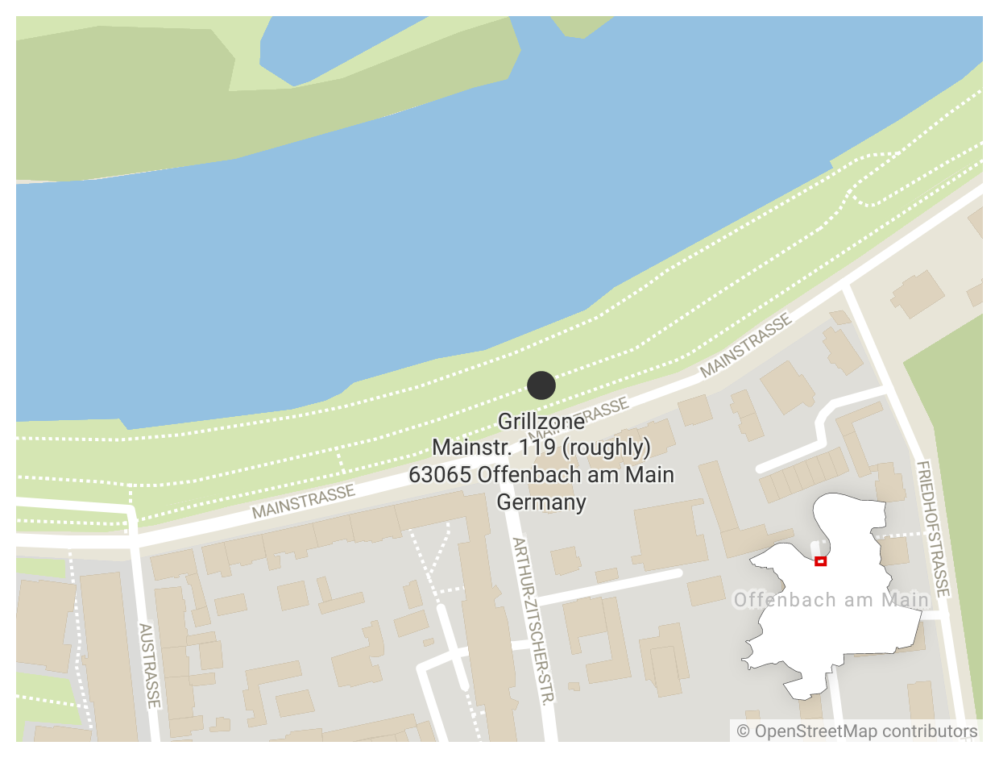
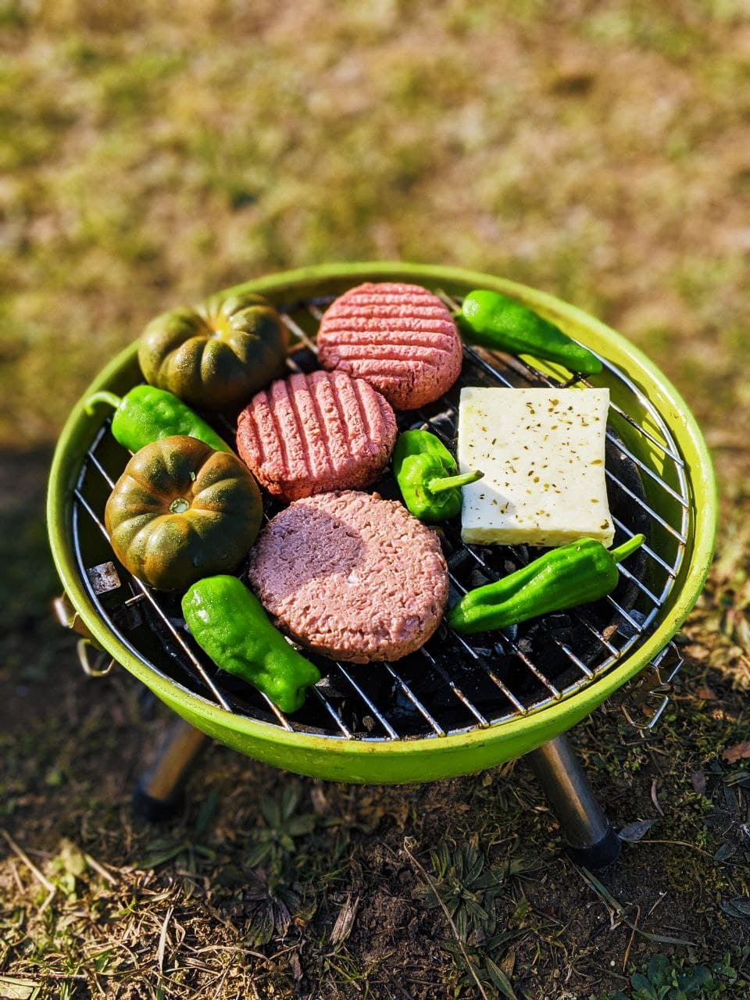

# Meetup Summer BBQ Party
__Offenbach and Frankfurt unite for a riverside Saturday-afternoon BBQ!__
- __Saturday, 30.7.2022 at 4:00pm__   

It's time for the fourth edition of the big Meetup summer BBQ. This event in which several Meetup groups join forces was great fun in previous years, so we’ll do again.

We’ll have a picnic and chat, exchange ideas and practice languages. Please bring your own supplies! Drinks and food can be bought at a [supermarket near the venue](https://www.rewe.de/marktseite/offenbach-mathildenviertel/241179/rewe-markt-mathildenstrasse-15-19/), and he organizers will also have some cutlery, plates, etc. Nonetheless, bringing your own is a plus. If you have your own grill, we encourage you to bring it, too. "Better safe than sorry" :)

Don't forget your picnic blankets :)

The event is free of charge, but there will be a voluntary piggy bank going around to offset the cost of organization. Note that the starting time of the event may be moved closer to the date depending on the weather.

# [Sign Up On Meetup.com](https://www.meetup.com/terpffm/events/286359781/)
If you do not want to use meetup, please send Brian a [Telegram](https://t.me/brianjl) or [email](mailto:brian@thejunkyard.cc?subject=I'm%20coming%20to%20the%20Meetup%20BBQ%20on%20July%2030th.&body=Hi%20Brian%2C%0D%0A%0D%0AI%20would%20like%20to%20come%20to%20the%20Meetup%20BBQ%20in%20Offenbach.%0D%0A%0D%0ACheers%2C%0D%0A%0D%0AYOUR%20NAME%20HERE).

