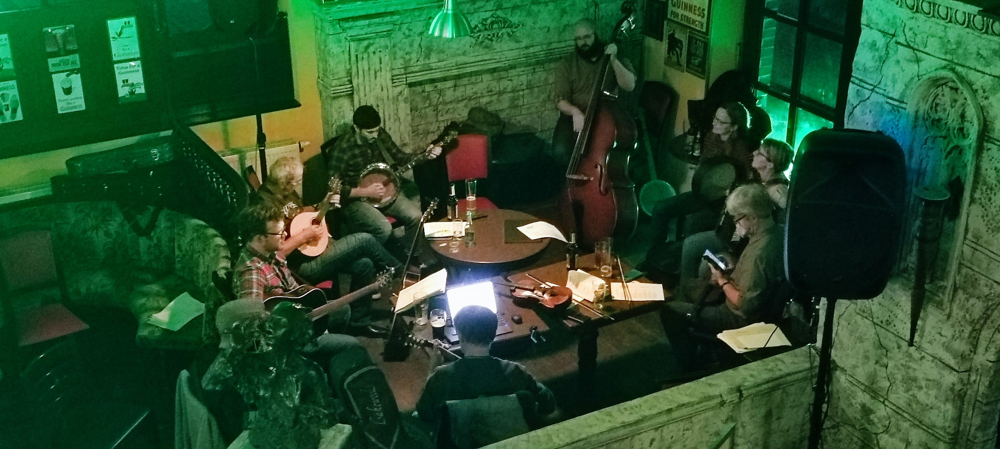

## Who are we?
Main & Wine is an informal social group of English speakers in the Offenbach area that meets regularly for lunch or evening drinks. We come from all over the world, but we all speak (some) English. Newcomers are welcome to join at any time! [Facebook](https://www.facebook.com/groups/offenbachenglishspeakers) and [Telegram](https://t.me/mainandwine) are our means of communication and organization. 

## Join Us Online...
### [**Facebook Group**](https://www.facebook.com/groups/offenbachenglishspeakers) 
### [**Telegram Group**](https://t.me/mainandwine)

## Or Attend an Event!
### Thursday English Lunchbreak
- __Thursdays at 12:30-1:30pm__
- __Varying Locations in Offenbach__
- __See FB or Telegram for the next planned event!__  

### Riverside Barbecue!
- __Occasional Saturdays at 2pm__
- __At riverside "Grillbereich" (by Friedhofstr.)__
- __See FB or Telegram for the next planned event!__ 

### [Live Irish and American Folk Music @AnSibinIrishPub](/events_livemusic_final_sunday)
- __Every final Sunday of the month at 7:00pm__
- __Ernst-Griesheimer-Platz 7__  
  __63071 Offenbach am Main__

  
## [Past Events](https://mainandwine.eu/events)

## [Gallery](https://mainandwine.eu/gallery)

## [Instagram](https://www.instagram.com/ofenglishspeakers/)

## [Impressum](https://mainandwine.eu/impressum)
